# Bidify - Digital Auction Platform

This is a demo project built by Mumu and Hena as part of Vue.js and Node.js learning. The backend is developed using these tools and technologies: Express, MongoDB, Socket.io. And the frontend is developed using Vue.js, Pinia, Socket.io.

## User Flow

```mermaid
flowchart TB
    %% Start of Application Flow
    Start((Start)) --> Login{Has Account?}

    %% Authentication Flow
    subgraph Authentication [Authentication]
        direction TB
        Login -->|No| Register[Register Account]
        Register -->|Success| NotifyReg[Notify: Registration Complete]
        Register -->|Error| RetryReg[Retry Registration]

        Login -->|Yes| LoginForm[Login]
        LoginForm -->|Error| RetryLogin[Retry Login]
        LoginForm -->|Success| Dashboard
        NotifyReg --> LoginForm
    end

    %% Main Application Flow
    subgraph MainApp [Main Application]
        direction TB
        Dashboard[Dashboard]

        %% Seller Flow
        subgraph SellerFlow [Seller Flow]
            direction TB
            Dashboard -->|Create Item| CreateItem[Create Auction Item]
            CreateItem -->|Fill Details| ItemForm[/Enter Details:\n- Title\n- Description\n- Start Bid\n- Increment Amount\n- End Time\n- Images/]
            ItemForm -->|Submit| ItemCreated[Item Listed]
            ItemCreated --> ManageItem{Manage Item}
            ManageItem -->|Cancel| CancelItem[Cancel Auction]
            ManageItem -->|Mark Sold| SoldItem[Mark as Sold]
            ManageItem -->|Reactivate| ReactivateItem[Reactivate Auction]
        end

        %% Buyer Flow
        subgraph BuyerFlow [Buyer Flow]
            direction TB
            Dashboard -->|Browse Items| ViewItems[View All Items]
            ViewItems --> ItemDetails[Item Details]
            ItemDetails -->|Join Room| BidRoom[Enter Bid Room]
            BidRoom --> PlaceBid{Place Bid?}
            PlaceBid -->|Yes| SubmitBid[Submit Bid]
            SubmitBid -->|Success| BidPlaced[Bid Successful]
            SubmitBid -->|Error| BidError[Error: Invalid Bid]
            BidPlaced --> BidRoom
            PlaceBid -->|No| ContinueBrowsing[Continue Browsing]
        end

        %% Notification Flow
        subgraph Notifications [Notification Center]
            direction TB
            NotifTypes{Notification Types}
            NotifTypes -->|New Bid| BidNotif[New Bid Notification]
            NotifTypes -->|Outbid| OutbidNotif[Outbid Notification]
            NotifTypes -->|Won| WonNotif[Won Auction Notification]
            NotifTypes -->|Ended| EndedNotif[Auction Ended Notification]

            NotifActions{Notification Actions}
            NotifActions -->|Mark as Read| MarkRead[Mark Read]
            NotifActions -->|Mark All as Read| MarkAllRead[Mark All Read]
        end

        %% Profile Management
        subgraph ProfileManagement [Profile Management]
            direction TB
            Dashboard -->|Profile| UserProfile[User Profile]
            UserProfile --> ProfileActions{Profile Actions}
            ProfileActions -->|View Items| UserItems[View Listed Items]
            ProfileActions -->|View Wins| WinningItems[View Winning Items]
            ProfileActions -->|Update Profile| UpdateProfile[Edit Profile]
            ProfileActions -->|Change Password| ChangePass[Update Password]
        end
    end

    %% Styling
    classDef default fill:#f9f9f9,stroke:#333,stroke-width:1px;
    classDef auth fill:#e6f3ff,stroke:#333,stroke-width:1px;
    classDef seller fill:#f0fff0,stroke:#333,stroke-width:1px;
    classDef buyer fill:#fff0f0,stroke:#333,stroke-width:1px;
    classDef notif fill:#fff3e6,stroke:#333,stroke-width:1px;
    classDef profile fill:#f0f0ff,stroke:#333,stroke-width:1px;

    class Start,Login,Register,LoginForm,RetryLogin,RetryReg,NotifyReg auth;
    class CreateItem,ItemForm,ItemCreated,ManageItem,CancelItem,SoldItem,ReactivateItem seller;
    class ViewItems,ItemDetails,BidRoom,PlaceBid,SubmitBid,BidPlaced,BidError,ContinueBrowsing buyer;
    class NotifTypes,BidNotif,OutbidNotif,WonNotif,EndedNotif,NotifActions,MarkRead,MarkAllRead notif;
    class UserProfile,ProfileActions,UserItems,WinningItems,UpdateProfile,ChangePass profile;

```

## REST API and Socket DFD Diagram

