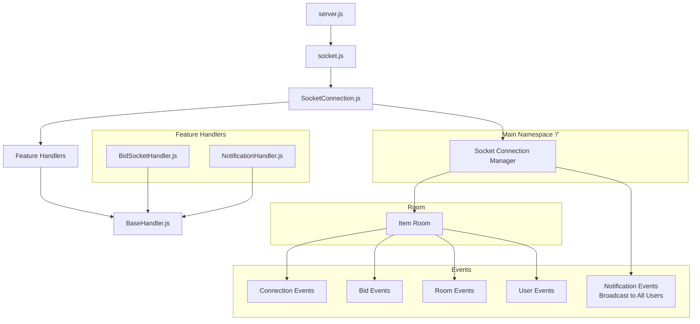

# Bidify - Backend

## Overview

Bidify is a real-time auction platform that allows users to create, manage, and participate in online auctions. The system includes user authentication, item management, bidding functionality, and real-time notifications through WebSocket integration.

## Tech Stack

- Node.js with Express
- MongoDB with Mongoose
- WebSocket for real-time features
- JWT for authentication

## Initial Project Setup Steps

1. **Project Initialization**

   ```bash
   yarn init
   ```

2. **Install Required Packages**

   ```bash
   # Core dependencies
   yarn add express mongoose jsonwebtoken bcryptjs cors dotenv multer

   # Development dependencies
   yarn add -D eslint prettier
   yarn add -D eslint-config-prettier eslint-plugin-prettier eslint-plugin-import
   ```

3. **Environment Setup**
   Create a `.env` file with the following variables:

   ```
   MONGODB_URI=your_mongodb_connection_string
   DB_NAME=any_name
   CORS_ORIGIN=*
   PORT=8080
   NODE_ENV=development
   JWT_ACCESS_SECRET=your_secret
   JWT_ACCESS_EXPIRY=1d
   ```

   Generate JWT secret using:

   ```bash
   node -e "console.log(require('crypto').randomBytes(128).toString('base64'));"
   ```

4. **Datebase Connection & Seeding**

   Datebase will connect using the environment variables, make sure you update your env.

   If you want to populate documents on empty DB change the `const MONGODB_URI = 'your_secret_uri';` from the file `seedDatabase.js` in the root folder and run the follow

   ```bash
   node seedDatabase.js
   ```

## API Documentation

### Authentication Endpoints

#### Register User

```http
POST /api/auth/register
Content-Type: application/json

{
  "firstName": "John",
  "lastName": "Doe",
  "email": "john@example.com",
  "contactNumber": "1234567890",
  "password": "StrongPass123"
}
```

#### Login

```http
POST /api/auth/login
Content-Type: application/json

{
  "email": "john@example.com",
  "password": "StrongPass123"
}
```

### User Management Endpoints

#### Get Profile

```http
GET /api/user/profile
Authorization: Bearer <token>
```

#### Update Profile

```http
PUT /api/user/profile/update
Authorization: Bearer <token>
Content-Type: application/json

{
  "firstName": "John",
  "lastName": "Doe",
  "contactNumber": "1234567890",
  "address": {
    "street": "123 Main St",
    "city": "Anytown",
    "country": "Country"
  }
}
```

### Item Management Endpoints

#### Create Item

```http
POST /api/item/create
Authorization: Bearer <token>
Content-Type: multipart/form-data

{
  "title": "Vintage Item",
  "description": "Description here",
  "startingBid": 100,
  "minimumBidIncrement": 10,
  "endTime": "2025-12-31T23:59:59Z",
  "images": [File]
}
```

#### Get Items

- Get All Items: `GET /api/item/all`
- Get by Slug: `GET /api/item/:slug`
- Get User's Listed Items: `GET /api/item/user-enlisted-items`
- Get User's Winning Items: `GET /api/item/user-winning-items`

#### Update Item

```http
PATCH /api/item/update/:id
Authorization: Bearer <token>
Content-Type: application/json

{
  "title": "Updated Title",
  "description": "Updated description"
}
```

#### Delete Item

```http
DELETE /api/item/delete/:id
Authorization: Bearer <token>
```

### Bidding Endpoints

#### Place Bid

```http
POST /api/bid/place-bid
Authorization: Bearer <token>
Content-Type: application/json

{
  "itemId": "item_id_here",
  "incrementBidAmount": 20
}
```

#### Get Latest Bids

```http
GET /api/bid/latest-10-bids?itemId=item_id_here
Authorization: Bearer <token>
```

### Notification Endpoints

#### Get Notifications

```http
GET /api/notification
Authorization: Bearer <token>
```

#### Mark Notification as Read

```http
PUT /api/notification/:notificationId/mark-read
Authorization: Bearer <token>
```

## WebSocket Integration

### WebSocket Connection

### 1. Architecture



### 2. Implementation Steps

1. **Create Feature Handler**

```javascript
// filepath: /socketHandlers/YourFeatureHandler.js
import BaseSocketHandler from './BaseHandler.js';

class YourFeatureHandler extends BaseSocketHandler {
  constructor(io) {
    super(io);
  }

  handleSomeEvent = (socket, data) => {
    // Handle event
    this.emitToRoom(`room-${data.id}`, 'event-name', data);
  };
}
```

### 3. Register in SocketConnection

```js
// In SocketConnection.js
import YourFeatureHandler from './YourFeatureHandler.js';

class SocketConnection {
  constructor(io) {
    this.featureHandler = new YourFeatureHandler(io);
  }

  initialize() {
    this.io.on('connection', (socket) => {
      socket.on('your-event', (data) => {
        this.featureHandler.handleSomeEvent(socket, data);
      });
    });
  }
}
```

#### 4. Available Methods

- emitToRoom(room, event, data): Emit to all in room
- broadcastToRoom(socket, room, event, data): Emit to all except sender
- emitToUser(socketId, event, data): Emit to specific user

#### 5. Event Flow Example

```js
// Client -> Server
socket.emit('join-room', roomId);

// Server -> Room
this.emitToRoom(`room-${roomId}`, 'user-joined', userData);

// Server -> Individual
this.emitToUser(socketId, 'private-message', message);
```
```javascript
// Client-side connection
const socket = io('http://localhost:8080', {
  auth: {
    token: 'your_jwt_token',
  },
});

// Listen for events
socket.on('bid-placed', (data) => {
  console.log('New bid:', data);
});

// Join auction room
socket.emit('join-auction', { auctionId: 'auction_id_here' });
```

### Event Types

#### Connection Events

- `connection`: Socket connection established
- `disconnect`: Socket disconnection
- `error`: Error event

#### Bid Events

- `join-item-room`: Join an item's auction room
- `leave-item-room`: Leave an item's auction room
- `place-bid`: Submit a new bid
- `place-bid-result`: Result of bid placement
- `new-bid-placed`: Broadcast when new bid is placed
- `auction-ended`: Auction time has expired
- `item-sold`: Item has been sold

#### Room Events

- `user-joined-room`: User entered a room
- `user-left-room`: User left a room

#### User Events

- `user-connected`: User connected to socket
- `user-disconnected`: User disconnected from socket

#### Notification Events

- `mark-all-read`: Mark all notifications as read
- `mark-as-read`: Mark specific notification as read
- `place-bid-notification`: New bid placed notification
- `outbid-notification`: User has been outbid
- `auction-winner`: Auction winner notification
- `auction-end`: Auction ended notification
- `auction-canceled`: Auction canceled notification

#### Admin Events

- `get-active-users`: Request active users list
- `active-users-list`: Response with active users
- `get-room-users`: Request users in a room
- `room-users-list`: Response with room users

### Response Types

```javascript
const RESPONSE_TYPES = {
  SUCCESS: 'success',
  ERROR: 'error',
};
```

### WebSocket Connection Examples

#### Basic Connection

```javascript
// Client-side connection
const socket = io('http://localhost:8080', {
  auth: {
    token: 'your_jwt_token',
  },
});
```

#### Joining Auction Room

```javascript
// Join an auction room
socket.emit('join-item-room', { itemId: 'item_id_here' });

// Listen for new bids
socket.on('new-bid-placed', (data) => {
  console.log('New bid:', data);
});

// Listen for auction end
socket.on('auction-ended', (data) => {
  console.log('Auction ended:', data);
});
```

#### Placing Bids

```javascript
// Place a bid
socket.emit('place-bid', {
  itemId: 'item_id_here',
  amount: 100,
});

// Listen for bid result
socket.on('place-bid-result', (result) => {
  if (result.type === RESPONSE_TYPES.SUCCESS) {
    console.log('Bid placed successfully');
  } else {
    console.log('Bid failed:', result.message);
  }
});
```

#### Handling Notifications

```javascript
// Connect to notification namespace
const notificationSocket = io('/notification', {
  auth: { token: 'your_jwt_token' },
});

// Listen for various notification types
notificationSocket.on('place-bid-notification', (data) => {
  console.log('New bid placed:', data);
});

notificationSocket.on('outbid-notification', (data) => {
  console.log('You have been outbid:', data);
});

notificationSocket.on('auction-winner', (data) => {
  console.log('Auction won:', data);
});

// Mark notifications as read
notificationSocket.emit('mark-as-read', {
  notificationId: 'notification_id_here',
});
```

#### Admin Monitoring

```javascript
// Connect to admin namespace
const adminSocket = io('/admin', {
  auth: { token: 'admin_token_here' },
});

// Get active users
adminSocket.emit('get-active-users');
adminSocket.on('active-users-list', (users) => {
  console.log('Active users:', users);
});

// Monitor room users
adminSocket.emit('get-room-users', { roomId: 'room_id_here' });
adminSocket.on('room-users-list', (users) => {
  console.log('Users in room:', users);
});
```


## Push Notification Service

#### 1. Generate Vapid Keys

To enable Web Push Notifications, you need to generate VAPID keys and configure them in both the backend and frontend.

## Steps to Generate VAPID Keys:

1. **Navigate to the backend directory**:

   ```bash
   cd backend
   ```

2. **Generate VAPID keys using the web-push library:**:

   ```bash
   .\node_modules\.bin\web-push generate-vapid-keys
   ```

3. **Save the keys in the respective .env files:**:

- Copy the generated Public Key and Private Key.
- In the backend's .env file, add the following:
  ```bash
  VAPID_PUBLIC_KEY=<your_generated_public_key>
  VAPID_PRIVATE_KEY=<your_generated_private_key>
  ```
- In the frontend's .env file, add the public key:
  ```bash
  VITE_VAPID_PUBLIC_KEY=<your_generated_public_key>
  ```


## Security Considerations

1. **Authentication**

   - All tokens are JWT-based
   - Tokens expire after 24 hours
   - Passwords are hashed using bcrypt

2. **Authorization**

   - Item modifications restricted to sellers
   - Bid placement requires authentication
   - Profile updates restricted to own profile

3. **Input Validation**
   - All inputs are validated before processing
   - File uploads restricted to images
   - Bid amounts validated against minimum increment

## Error Handling

The API uses standard HTTP status codes and global error handler to return errors in the following format:

```json
{
  "statusCode": 400 - 500,
  "data": [],
  "message": "Error Message",
  "success": false,
  "error": "Additional error details"
  }
}
```
