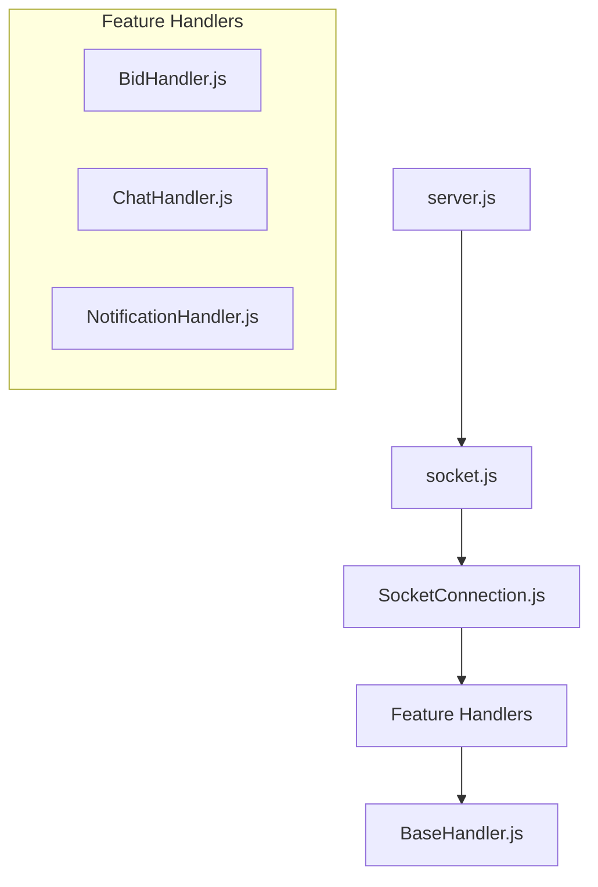

## Initial Project Setup Steps

1. Project init

   ```bash
     yarn init
   ```

2. Install required packages for initial setup

   ```bash
     yarn add express mongoose

     yarn add -D eslint prettier
     yarn add -D eslint-config-prettier eslint-plugin-prettier eslint-plugin-import
   ```

3. Create essential config files for Prettier, ESLint, and `jsconfig.json`.

## Authentication and Authorization

Run this command to generate `JWT Access Secrets` used in .env:

```bash
node -e "console.log(require('crypto').randomBytes(128).toString('base64'));"
```

## Auth API Endpoints

### 1. **User Registration**

**POST Request:**
`http://localhost:8080/api/auth/register`

#### Request Body (Example):

```json
{
  "firstName": "afnan",
  "lastName": "mumu",
  "email": "abc@gmail.com",
  "contactNumber": "01773046092",
  "password": "Abc123sd"
}
```

### 2. **User Login**

**POST Request:**
`http://localhost:8080/api/auth/login`

#### Request Body (Example):

```json
{
  "email": "abc@gmail.com",
  "password": "Abc123sd"
}
```

## User API Endpoints

### 1. **User Profile**

**GET Request:**
`http://localhost:8080/api/user/profile`

#### Request Header (Example):

```bash
Authorization: Bearer <token>
```

### 2. **User Profile Update**

#### Request Header (Example):

**PUT Request:**
`http://localhost:8080/api/user/profile/update`

```bash
Authorization: Bearer <token>
```

```bash
{
  "firstName": "John",
  "lastName": "Doe",
  "contactNumber": "01334567890",
  "address": {
    "street": "134566 Main St",
    "city": "Dhaka",
    "country": "Bangladesh"
  }
}
```

### 3. **User Password Update**

#### Request Header (Example):

**PUT Request:**
`http://localhost:8080/api/user/profile/password-change`

```bash
Authorization: Bearer <token>
```

```bash
{
  "currentPassword": "Abc123sdwq1",
  "newPassword": "Abc123sdwq"
}
```

## Item API Endpoints

### 1. **Get All Items**

**GET Request:**
`http://localhost:8080/api/item/all`

### 2. **Get Item by Slug**

**GET Request:**
`http://localhost:8080/api/item/:slug`

#### URL Parameters:

- `:slug` (string): The slug of the item to retrieve.

### 3. **Create Item**

**POST Request:**
`http://localhost:8080/api/item/create`

#### Request Body (Example):

```json
{
  "title": "Vintage Wooden Table",
  "description": "A beautiful handcrafted vintage wooden table, perfect for your living room or study.",
  "startingBid": 100,
  "minimumBidIncrement": 10,
  "endTime": "2024-12-31T23:59:59Z"
}
```

#### Request Header:

```bash
Authorization: Bearer <token>
```

### 4. **Update Item**

**PATCH Request:**
`http://localhost:8080/api/item/update/:id`

#### URL Parameters:

- `:id` (string): The ID of the item to update.

#### Request Body (Example):

```json
{
  "title": "Updated Vintage Wooden Table",
  "description": "An updated description for the vintage wooden table.",
  "startingBid": 120
}
```

#### Request Header:

```bash
Authorization: Bearer <token>
```

#### Authorization Check:

- Only the user who created the item (identified by `sellerId`) can update it.

### 5. **Delete Item**

**DELETE Request:**
`http://localhost:8080/api/item/delete/:id`

#### URL Parameters:

- `:id` (string): The ID of the item to delete.

#### Request Header:

```bash
Authorization: Bearer <token>
```

#### Authorization Check:

- Only the user who created the item (identified by `sellerId`) can delete it.

## WebSocket Integration Flow

### 1. Architecture

Server (server.js) ↓ Socket Initialization (socket.js) ↓ Socket Connection Manager (SocketConnection.js) ↓ Feature Handlers (BidHandler.js, etc.) ↓ Base Handler (BaseHandler.js)



### 2. Implementation Steps

1. **Create Feature Handler**

```javascript
// filepath: /socketHandlers/YourFeatureHandler.js
import BaseSocketHandler from './BaseHandler.js';

class YourFeatureHandler extends BaseSocketHandler {
  constructor(io) {
    super(io);
  }

  handleSomeEvent = (socket, data) => {
    // Handle event
    this.emitToRoom(`room-${data.id}`, 'event-name', data);
  };
}
```

### 3. Register in SocketConnection

```js
// In SocketConnection.js
import YourFeatureHandler from './YourFeatureHandler.js';

class SocketConnection {
  constructor(io) {
    this.featureHandler = new YourFeatureHandler(io);
  }

  initialize() {
    this.io.on('connection', (socket) => {
      socket.on('your-event', (data) => {
        this.featureHandler.handleSomeEvent(socket, data);
      });
    });
  }
}
```

#### 4. Available Methods

- emitToRoom(room, event, data): Emit to all in room
- broadcastToRoom(socket, room, event, data): Emit to all except sender
- emitToUser(socketId, event, data): Emit to specific user

#### 5. Event Flow Example

```js
// Client -> Server
socket.emit('join-room', roomId);

// Server -> Room
this.emitToRoom(`room-${roomId}`, 'user-joined', userData);

// Server -> Individual
this.emitToUser(socketId, 'private-message', message);
```
